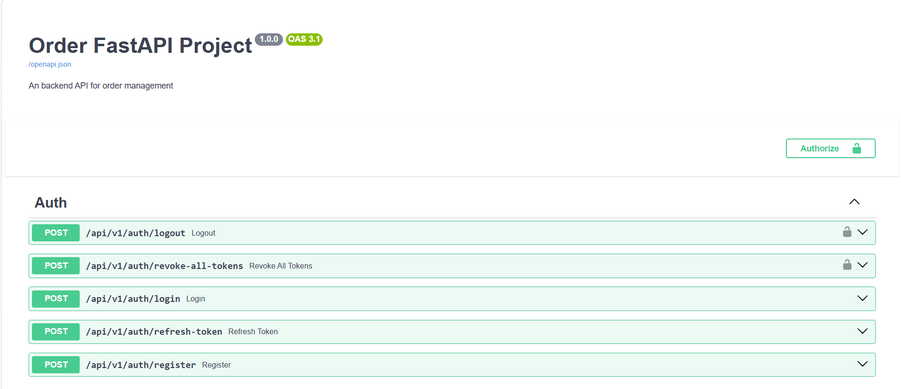

# Order Fast API - Modern Restaurant Management System

The **order_fast_api** project serves as a high-performance backend solution designed for digitalizing restaurant operations and food ordering workflows. Built with cutting-edge technology, this system ensures data consistency and provides a scalable architecture suitable for real-world business demands.

## Why FastAPI and the AI-Driven Future

The decision to utilize **FastAPI** with **Python 3.13.3** was driven by a strategic focus on future-proofing the application. Beyond its industry-leading performance and native asynchronous support, FastAPI offers a seamless environment for integrating Artificial Intelligence (AI) modules. We plan to implement intelligent features such as automated customer preference analysis, personalized dish recommendations, and predictive inventory management. The framework's strict type validation via Pydantic ensures that the complex data structures required by machine learning models are handled with maximum reliability and speed.

## Live Experience and Documentation

You can explore the live version of the application or interact with the API endpoints directly through the automated documentation interface.

### [**Click here to view the Live Demo**](https://order-fast-api.vercel.app/)

### Interactive API Exploration
The system provides a comprehensive Swagger UI that allows developers to test endpoints in real-time. This interactive documentation facilitates rapid frontend-backend integration and ensures clear communication of data schemas.



---

## System Initialization and Data Management

### Database and Schema Control
The project utilizes **Supabase** and **PostgreSQL** for robust data storage. Before running the application, you must establish the core structure by creating a database named `restaurant_database`. We use Alembic to manage schema evolution, ensuring that all database changes are version-controlled and easily deployable across different environments.

**Initialize Migrations:**
```bash
alembic init migrations
```

**Apply Migrations:**
```bash
python -m scripts.migrate <your_message>
```

### Seeding and Validation
To facilitate development and quality assurance, the system includes automated scripts for populating the database with realistic sample data and verifying the integrity of data models. This ensures that the business logic remains stable as the project scales.

**Seed Database:**
```bash
python -m scripts.seed
```

**Run Model Tests:**
```bash
python -m app.tests.test_model
```

### Installation and Technical Setup

This section provides the necessary steps to set up the local development environment.

**Environment Preparation**

Ensure that your system has Python 3.13.3 installed. It is highly recommended to use a virtual environment to isolate project dependencies and maintain a clean workspace.

```bash
# Create a virtual environment
python -m venv venv

# Activate the environment (Windows)
.\venv\Scripts\activate
# Activate the environment (Unix/macOS)
source venv/bin/activate

# Install the framework and essential dependencies
pip install fastapi[all]

# Export dependencies for production parity
pip freeze > requirements.txt
```

**Running the Application**

Once the environment and database are configured, launch the development server using Uvicorn with the following command:

```bash
uvicorn app.main:app --reload --port 8080
```

Access the local documentation at: 

